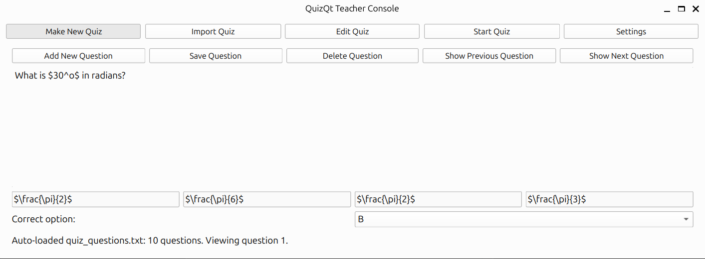
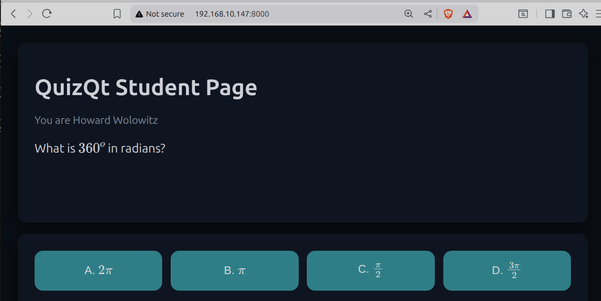

# QuizQt

Fast teacher console (Qt6) + student web page (FastAPI) for multiple-choice quizzes with Markdown/LaTeX support.

## Screenshots




## Quick start
```bash
python -m venv .venv
source .venv/bin/activate  # or .venv\Scripts\activate on Windows
pip install -r requirements.txt
python app_main.py
```
The Qt app launches and hosts the student page at `http://<teacher-ip>:8000/`.

## Quiz text format
Each question block in `quiz_questions.txt` looks like:
```
Q: Question text with $\LaTeX$
A: Option A
B: Option B
C: Option C
D: Option D
CORRECT: B
```
- `Q:` supports Markdown + inline or block LaTeX.
- Provide exactly four options A–D.
- `CORRECT:` is optional; omit it for ungraded questions.
